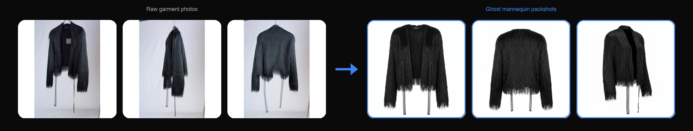

<p align="center">
  
  </br>
  <h3 align="center"><a href="https://on-model.com">Create Packshot by PiktID</a></h3>
</p>

<p align="center">
  <b>Generate clean, brand-ready product packshots from raw garment photos with AI.</b>
  <br/>

</p>

<p align="center">
  
</p>

# Create Packshot - v1.0
[](https://on-model.com)
[](https://app.on-model.com)
[](https://discord.com/invite/FJU39e9Z4P)

Create Packshot implementation by PiktID for generating clean product packshots from raw garment photos. This script takes garment-bearing images (phone snaps, hanger shots, mannequin shots, even on-model photos) and produces shop-ready packshots in four styles using the <a href="https://v2.api.piktid.com">PiktID v2 API</a>.

## Why On-Model?

- **Garment photos to clean packshots in minutes** — Upload phone snaps, hanger shots, or any garment-bearing image and get back ghost-mannequin, flat-lay, marketing-ready, or white-cutout packshots.
- **Identity-free** — Unlike flat-to-model and model-swap, packshots are product-only. No model, no identity step.
- **Stack instructions in one job** — Cover every catalog surface from a single upload. One ghost-mannequin set for your PDPs, one white-cutout set for marketplace feeds, one marketing-ready set for campaigns. All from the same input photos.
- **Four packshot styles** — `flat_lay`, `ghost_mannequin`, `marketing_ready`, `white_cutout`, plus `free` for unconstrained looks.
- **Batch processing** — Process entire product catalogs with parallel workers. Scale from 10 SKUs to 10,000.
- **Full API access** — Automate packshot generation in your existing workflow, PIM system, or custom pipeline.
- **4K output** — Production-ready resolution for web, print, and advertising.

Built by PiktID — the team behind [Studio](https://studio.piktid.com) and EraseID, used by 300,000+ people for AI-powered image processing.

## About On-Model

[On-Model](https://on-model.com) is an AI-powered platform by PiktID designed for fashion e-commerce. It enables brands, retailers, and marketplaces to transform their product imagery at scale:

- **Create Packshot** — Generate clean product packshots from raw garment photos (this repo)
- **Flat-to-Model** — Convert flat-lay product photography into realistic on-model images
- **Model Swap** — Replace models in existing product photos while preserving garments exactly as they are
- **Identity Management** — Create and maintain consistent AI model identities across your entire catalog

Try the platform at [app.on-model.com](https://app.on-model.com) — **15 free images per month**, no credit card required.

## Getting Started

The following instructions suppose you have already installed a recent version of Python. For a general overview, please visit the <a href="https://docs.piktid.com/docs/v2/create-packshot">API documentation</a>.

> **Step 0** - Register at <a href="https://app.on-model.com">app.on-model.com</a>. 15 images are given for free to all new users every month. Then generate an API token from your [profile dashboard](https://app.on-model.com/profile?tab=tokens).

> **Step 1** - Clone the Create Packshot repository
```bash
# Installation commands
$ git clone https://github.com/piktid/create-packshot.git
$ cd create-packshot
$ pip install requests
```

> **Step 2** - Prepare your garment folder with images

Place your garment images (JPG, JPEG, or PNG format) in a folder. Create Packshot accepts **1 to 10 photos** of the same garment per job. More angles produce sharper packshots, so a front + back pair beats a single front-only shot. Hanger shots, mannequin shots, even casual phone snaps all work as inputs.

> **Step 3** - Run a packshot job

The simplest possible run uses the default `ghost_mannequin` style:

```bash
$ python create_packshot.py \
  --input-folder garments/BLAZER123 \
  --token YOUR_API_TOKEN \
  --output-folder results/BLAZER123
```

Stack multiple styles in one job with a JSON instructions file (see `example_instructions.json`):

```bash
$ python create_packshot.py \
  --input-folder garments/BLAZER123 \
  --token YOUR_API_TOKEN \
  --instructions-file example_instructions.json \
  --output-folder results/BLAZER123
```

> **Step 4** - Monitor the processing

The script will automatically:
1. Authenticate with the API
2. Upload all garment images from the input folder
3. Create a project (or reuse an existing one)
4. Build instructions from CLI flags or JSON file
5. Create a create-packshot job
6. Monitor job progress
7. Download results to the output folder

You'll see progress updates in the console. Once complete, generated packshots will be saved to your output folder.

> **Step 5** - Review results

Results are saved to the output folder with the following structure:
```
output/
├── output_0_0_v0.jpg     # First instruction, first variation
├── output_0_1_v0.jpg     # First instruction, second variation
├── output_1_0_v0.jpg     # Second instruction, first variation
└── metadata.json         # Complete job information and results
```

The `metadata.json` file contains:
- Job ID and status
- Processing results for each output
- Quality scores and processing times
- Image URLs and metadata

## API Flow

The script follows this sequence of API calls:

All requests are authenticated with a Bearer token (generated from your [profile dashboard](https://app.on-model.com/profile?tab=tokens)) in the `Authorization` header.

```
1. POST /upload             -> Get pre-signed S3 URL + file_id (per image)
2. PUT  <upload_url>        -> Upload image binary to S3
3. POST /project            -> Create project (get project_id)
4. POST /create-packshot    -> Submit job with project_id + file_ids + instructions
5. GET  /jobs/<id>/status   -> Poll until status = "completed"
6. GET  /jobs/<id>/results  -> Fetch output images (CloudFront URLs)
```

**No identity step.** Unlike flat-to-model and model-swap, create-packshot does not require an identity (the outputs are product-only). Step 4 sends ALL uploaded image UUIDs together along with an `instructions` array that controls how many outputs are generated and in which packshot styles.

**Credit cost:** 3 credits per output at `1K`, 5 at `2K`, 10 at `4K`.

## Instructions

Instructions control what gets generated. Each instruction produces one output image (or `num_variations` outputs). Stacking multiple instructions in one job produces N outputs from the same garment upload — that's the killer feature.

### Style values

Every instruction must include a `style`. The five accepted values:

| Style | Description | Best for |
|-------|-------------|----------|
| `flat_lay` | Top-down view of the garment laid on a clean surface. `angle` is forced to `top_down`. | Editorial product grids, lookbooks |
| `ghost_mannequin` | Invisible mannequin: garment hovers in 3D as if worn, no body visible. | Most fashion PDPs |
| `marketing_ready` | Editorial scene with props, lighting, and atmosphere. `props` and `color_palette` carry weight here. | Campaign imagery, hero banners |
| `white_cutout` | Pure white seamless background with sharp edges and minimal contact shadow. | Marketplaces (Amazon, Zalando), feeds |
| `free` | Unconstrained. The engine interprets the structured fields and `prompt` without applying a style preset. | Custom looks that don't fit the four above |

Some fields are style-conditional:
- `props` and `color_palette` are most meaningful for `marketing_ready`.
- `surface` only applies to `flat_lay`.
- `top_down` angle is forced for `flat_lay` regardless of what you set.

### Simple Mode (CLI Flags)

Use individual flags to build a single instruction:

```bash
$ python create_packshot.py \
  --input-folder garments/BLAZER123 \
  --token YOUR_API_TOKEN \
  --style ghost_mannequin \
  --background "white studio" \
  --framing tall_3_4 \
  --angle three_quarter \
  --shadow contact \
  --num-variations 3 \
  --aspect-ratio 3:4 \
  --size 2K
```

### Advanced Mode (JSON File)

For multiple instructions or complex configurations, use `--instructions-file`:

```bash
$ python create_packshot.py \
  --input-folder garments/BLAZER123 \
  --token YOUR_API_TOKEN \
  --instructions-file example_instructions.json
```

See `example_instructions.json` for the full format. The JSON file should contain a list of instruction objects:

```json
[
  {
    "style": "ghost_mannequin",
    "background": "white studio",
    "framing": "tall_3_4",
    "angle": "three_quarter",
    "shadow": "contact",
    "num_variations": 3,
    "options": { "size": "2K", "ar": "3:4", "format": "jpg" }
  },
  {
    "style": "flat_lay",
    "surface": "linen",
    "shadow": "natural",
    "options": { "size": "2K", "ar": "1:1", "format": "jpg" }
  }
]
```

Total outputs from this example: 4 (3 ghost-mannequin variations + 1 flat-lay) from one garment upload.

### Instruction Fields

| Field | Type | Description |
|-------|------|-------------|
| `style` | enum | One of `flat_lay`, `ghost_mannequin`, `marketing_ready`, `white_cutout`, `free`. Required. |
| `background` | string \| int \| object | Background descriptor (e.g. `"white studio"`). Plain text, Design Value index, or `{text, image}` object. |
| `composition` | string \| int \| object | Composition descriptor (e.g. `"single garment centered"`). |
| `props` | string \| int \| object | Props for the scene. Only meaningful for `marketing_ready`. |
| `surface` | string \| int \| object | Surface the garment lies on. Only meaningful for `flat_lay`. |
| `color_palette` | string \| int \| object | Color scheme descriptor. Most useful for `marketing_ready`. |
| `lighting` | string \| int \| object | Lighting descriptor. Plain text or `{direction, quality, complexity}` object. |
| `framing` | enum | `square_packshot`, `tall_3_4`, `wide_4_3`, `full_frame`. |
| `angle` | enum | `front`, `back`, `three_quarter`, `top_down`, `detail_macro`. |
| `shadow` | enum | `auto`, `none`, `contact`, `soft_drop`, `natural`. |
| `prompt` | string | Free-form prompt overlay. The engine combines it with the structured fields. |
| `seed` | int | Reproducibility seed for this instruction. |
| `num_variations` | int (1-8) | Number of output variations to generate from this instruction. |
| `options.size` | string | Output resolution: `"1K"`, `"2K"`, `"4K"`. |
| `options.ar` | string | Aspect ratio: `"1:1"`, `"3:4"`, `"4:3"`, `"9:16"`, `"16:9"`. |
| `options.format` | string | Output format: `"png"` or `"jpg"`. |
| `options.width` / `options.height` | int | Custom output dimensions (256-7000, multiples of 8, ratio 1:4 to 4:1). Both must be provided together. Requires the `OUTPUT_CUSTOM_DIMENSIONS` policy on your account. |

### Per-image annotations

Add notes to individual images to highlight context the AI might otherwise miss:

```bash
$ python create_packshot.py \
  --input-folder garments/BLAZER123 \
  --token YOUR_API_TOKEN \
  --image-notes "front view" "back view" "detail of printed lining"
```

Notes are matched to images in upload order. Use empty string `""` to skip an image.

## Command Line Options

```
--input-folder        Path to folder containing garment images (required)
--token               API token (required) — generate at https://app.on-model.com/profile?tab=tokens
--output-folder       Output folder for results (default: output)
--base-url            API base URL (default: https://v2.api.piktid.com)
```

**Instruction flags (simple mode):**
```
--style               flat_lay | ghost_mannequin | marketing_ready | white_cutout | free  (default: ghost_mannequin)
--prompt              Free-form prompt overlay
--background          Background description
--framing             square_packshot | tall_3_4 | wide_4_3 | full_frame
--angle               front | back | three_quarter | top_down | detail_macro
--shadow              auto | none | contact | soft_drop | natural
--surface             Surface description (flat_lay style only)
--num-variations      Number of output variations (1-8, default: 1)
--size                Output resolution: 1K, 2K, 4K
--aspect-ratio        Aspect ratio: 1:1, 3:4, 4:3, 9:16, 16:9
--format              Output format: png, jpg
--seed                Seed value for reproducibility
```

**Advanced mode:**
```
--instructions-file   Path to JSON file with instructions (overrides simple flags)
```

**Image annotations:**
```
--image-notes         Per-image styling notes in upload order
```

**Generation options (job-level, apply to the whole job — not per instruction):**
```
--model               Generation engine: auto | nano_banana_pro | seedream (default: auto)
--use-anchor          Pin one instruction as the canonical reference (default: off)
--anchor-index        Which instruction is the anchor when --use-anchor is set (default: 0)
--post-process        Enable automatic post-processing
```

## Advanced: choosing a generation model

By default, On-Model picks the best generation engine for you (`--model auto`). The default engine runs with a safety fallback if the primary engine refuses the content. You can also force a specific engine:

```bash
$ python create_packshot.py \
  --input-folder garments/BLAZER123 \
  --token YOUR_API_TOKEN \
  --model nano_banana_pro
```

Accepted values: `auto` (default), `nano_banana_pro`, `seedream`. Forcing a specific engine disables the safety fallback — if that engine refuses the content, the job fails instead of switching engines.

Each entry in the job results response carries a `model_used` field indicating which engine actually produced that image. The script prints it next to each downloaded file (e.g. `Downloaded: output_0_0_v0.jpg (model: nano_banana_pro)`) and the raw value is preserved in `metadata.json`.

## Advanced: stacking instructions

Stacking multiple instructions in a single job lets you cover every catalog surface from one garment upload. A typical e-commerce stack:

```json
[
  { "style": "ghost_mannequin", "framing": "tall_3_4", "angle": "front", "options": { "size": "2K", "ar": "3:4" } },
  { "style": "ghost_mannequin", "framing": "tall_3_4", "angle": "back",  "options": { "size": "2K", "ar": "3:4" } },
  { "style": "white_cutout",   "framing": "square_packshot", "options": { "size": "2K", "ar": "1:1" } },
  { "style": "flat_lay",        "surface": "linen", "options": { "size": "2K", "ar": "1:1" } },
  { "style": "marketing_ready", "background": "concrete loft", "props": "minimal", "options": { "size": "4K", "ar": "16:9" } }
]
```

One upload, one job, five surfaces covered (PDP front, PDP back, marketplace feed, editorial flat-lay, campaign hero). All from the same input photos. This is the architectural advantage of create-packshot over running five separate jobs.

## Advanced: anchoring outputs

When you stack instructions, each output is generated independently by default — different styles intentionally diverge. If you want the engine to align outputs to one canonical look (e.g. all variations match the lighting and color tone of a specific instruction), enable `--use-anchor` and point `--anchor-index` at the instruction you want to use as the reference:

```bash
$ python create_packshot.py \
  --input-folder garments/BLAZER123 \
  --token YOUR_API_TOKEN \
  --instructions-file example_instructions.json \
  --use-anchor \
  --anchor-index 0
```

Anchoring is **off by default** for create-packshot (the opposite of flat-to-model). Most packshot users want stylistic divergence between instructions; anchoring is the opt-in for the rarer "matching set" use case.

## Usage Examples

### Example 1: Single ghost-mannequin job

Generate a single ghost-mannequin packshot with default settings:
```bash
$ python create_packshot.py \
  --input-folder garments/BLAZER123 \
  --token YOUR_API_TOKEN \
  --output-folder output/BLAZER123
```

### Example 2: Three ghost-mannequin variations

```bash
$ python create_packshot.py \
  --input-folder garments/BLAZER123 \
  --token YOUR_API_TOKEN \
  --style ghost_mannequin \
  --num-variations 3 \
  --aspect-ratio 3:4 \
  --size 2K
```

### Example 3: Stack ghost-mannequin + flat-lay in one job

Use the bundled `example_instructions.json` to produce 4 outputs (3 ghost-mannequin + 1 flat-lay) from a single upload:
```bash
$ python create_packshot.py \
  --input-folder garments/BLAZER123 \
  --token YOUR_API_TOKEN \
  --instructions-file example_instructions.json \
  --output-folder output/BLAZER123
```

### Example 4: Marketplace white-cutout

```bash
$ python create_packshot.py \
  --input-folder garments/BLAZER123 \
  --token YOUR_API_TOKEN \
  --style white_cutout \
  --aspect-ratio 1:1 \
  --size 2K
```

### Example 5: Per-image notes

Add context for each image so the AI preserves the right details:
```bash
$ python create_packshot.py \
  --input-folder garments/BLAZER123 \
  --token YOUR_API_TOKEN \
  --image-notes "front view" "back view" "shows printed inner lining, preserve in output"
```

## Batch Processing (Parallel)

For processing multiple garment folders at once, use `batch_create_packshot.py`. It runs multiple `CreatePackshot` instances in parallel using a thread pool, with each worker handling a complete independent workflow.

### Process all subfolders in a directory

```bash
$ python batch_create_packshot.py \
  --input-dir garments/ \
  --token YOUR_API_TOKEN \
  --output-dir results/
```

This scans `garments/` for subfolders and processes each one as a separate job. Results are saved to `results/<folder-name>/`.

### Process specific folders

```bash
$ python batch_create_packshot.py \
  --input-folders garments/BLAZER1 garments/BLAZER2 garments/BLAZER3 \
  --token YOUR_API_TOKEN \
  --output-dir results/ \
  --parallel 5
```

### Batch with stacked instructions

```bash
$ python batch_create_packshot.py \
  --input-dir garments/ \
  --token YOUR_API_TOKEN \
  --instructions-file example_instructions.json \
  --output-dir results/
```

The same instructions file is applied to every garment folder in the batch.

### Batch Command Line Options

```
--input-dir           Directory containing garment subfolders (mutually exclusive with --input-folders)
--input-folders       Specific garment folder paths to process (mutually exclusive with --input-dir)
--token               API token (required) — generate at https://app.on-model.com/profile?tab=tokens
--output-dir          Base output directory (default: output)
--base-url            API base URL (default: https://v2.api.piktid.com)
--parallel            Number of parallel workers (default: 3, max: 5)
```

All instruction flags (`--style`, `--background`, `--framing`, `--instructions-file`, etc.) are also supported and passed through to each worker.

Parallelism is capped at 5 to respect the API rate limit (5 requests/minute on `/create-packshot`). The built-in retry mechanism handles any 429 responses that occur when jobs are submitted close together.

A JSON summary file is saved to the output directory after each batch run with timing and success/failure details for every folder.

## Rate Limiting and Resilience

The script includes built-in handling for API rate limits:

- **Rate limiting (429):** All API calls automatically retry with exponential backoff (1s, 2s, 4s, 8s, 16s) plus random jitter, up to 5 retries per request
- **Token expiry (401):** If your token has expired, the script will print an error. Generate a new token at [app.on-model.com/profile?tab=tokens](https://app.on-model.com/profile?tab=tokens).

The `/create-packshot` endpoint is rate-limited to **5 requests per minute** and accounts have a concurrent-job cap (5 active jobs for non-enterprise plans, pooled with create-packshot, flat-to-model, and model-swap). The retry mechanism handles 429s transparently.

## Troubleshooting

### Authentication Failed
```
Token expired or invalid
```
**Solution:** Generate a new API token at [app.on-model.com/profile?tab=tokens](https://app.on-model.com/profile?tab=tokens). Tokens can be set to expire up to 4 years from issuance.

### No Images Found
```
No images found in garments/BLAZER123
```
**Solution:**
- Verify the input folder path is correct
- Check that the folder contains image files (JPG, JPEG, PNG)

### Too Many Images
```
Warning: found 15 images; create-packshot accepts max 10. Truncating to first 10.
```
**Solution:** create-packshot accepts a maximum of 10 images per job. Split your inputs into multiple folders (and use the batch processor) or trim the folder to the 10 most informative angles.

### Invalid Instructions File
```
Invalid instructions file: expected a list or {"instructions": [...]}
```
**Solution:**
- Ensure your JSON file contains a list of instruction objects, or a dict with an `"instructions"` key
- Validate the JSON syntax (use `python -m json.tool example_instructions.json` to check)
- Every instruction must have a `style` field

### Insufficient Credits
```
Failed to create job: 402
Response: {"error": "Insufficient credits to create job", "required_credits": 20.0, ...}
```
**Solution:** Top up your account at [app.on-model.com](https://app.on-model.com) or reduce the size/num_variations of your job. Pricing is 3/5/10 credits per output at 1K/2K/4K.

### Rate Limited
```
Rate limited (429). Waiting 2.1s before retry 1/5...
```
This is normal behavior. The script automatically retries with increasing delays. If you see "Max retries exceeded", wait a minute and try again.

### Job Timeout
```
Timeout: Job took longer than 1200 seconds
```
**Solution:** The job may be taking longer than expected. Check the API server status. You can modify the `max_wait_time` parameter in the `wait_for_job` method if needed.

### Connection Errors
```
Authentication error: Connection refused
```
**Solution:**
- Verify the API server is running
- Check the `--base-url` is correct
- Ensure network connectivity to the API server

## Error Handling

The script will exit with an error code if:
- Authentication fails
- No images are found in the input folder
- Instructions file is invalid or not found
- Job creation fails (including insufficient credits, invalid style, custom dimension violations)
- Job does not complete successfully
- Results download fails
- Rate limit retries are exhausted

Check the console output for detailed error messages.

## Links

- [On-Model Website](https://on-model.com) — Learn about the platform
- [On-Model App](https://app.on-model.com) — Try the app (15 free images/month)
- [Create Packshot API docs](https://docs.piktid.com/docs/v2/create-packshot) — Full API reference for this endpoint
- [Flat-to-Model Repo](https://github.com/piktid/flat-to-model) — Sister repo for flat-lay-to-on-model generation
- [Model Swap Repo](https://github.com/piktid/model-swap) — Sister repo for model swap
- [Create Identity Repo](https://github.com/piktid/create-identity) — Generate proprietary AI models from a brief or a reference image
- [API Documentation](https://docs.piktid.com/docs/v2) — Full API reference
- [PiktID](https://piktid.com) — Company website
- [Discord](https://discord.com/invite/FJU39e9Z4P) — Community and support

## Contact
office@piktid.com
